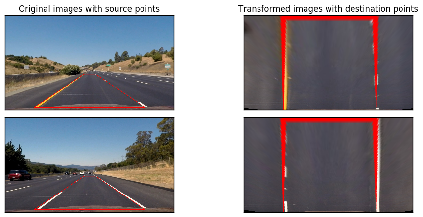

# CarND-Advanced-Lane-Lines

This is the 4th project of Udacity Self-Driving Car Nanodegree.

The goal of this project is to write a software pipeline to identify the lane boundaries in a video from a front-facing camera on a car.

The project can be divided into three parts.
1. Camera Calibration

  Camera images may be distorted. Distortion affects object details in the image. In order to obtain the real object information from the image, we need to correct distortion.

1. Pipeline (test images)

  Camera images contains lots of information not related to the lane lines, such as trees or shadow on the road. These noise should be removed from the image.

  One the other hand, the view point of the camera makes curvature detection harder. We should change the view point to bird’s eye view, then we can figure out the curvature easily, just like watching on the map.

1. Pipeline (video)

  Camera input during driving is continuous. We shall apply the pipeline we created on video inputs, see if our program works in a real situation or not.

## Camera Calibration
### Measuring Distortion
Image distortion can be measured by comparing the shape of an object in the real world and that in the image. Chessboard is one of the object that can be a good reference.

Chessboard contains squares and these squares are arranged in black and white, which means there should be no curve in the board. If the chessboard shown in the image contains curve, then the image is distorted.

Because diff area of the image may have different degree of distortion, so we should take multiple photos of chessboard from different view point and distance.

### Correcting for Distortion
When we know the degree of distortion, we can use perform transformation to undo the distortion.

The curves in the distorted images in distorted images become straight lines after transformation, which means the images are undistorted.

Now we have the correct parameter of the transformation, and we should transform all images from this camera with these parameter during our trial.

## Pipeline (test images)
### Perspective Transform
The camera view point is almost parallel to the road, so the shape of the lane line looks like a trapezoid, and it's hard to determine the curvature of the road, especially when the road is curved.

In order to better understand the curvature, we can transform the image into bird's eye view.

First we highlight a trapezoid in the image, which should be a rectangle in the real world. Then we get a set of parameter for transform this trapezoid into a rectangle.

We can now use these parameter to transform any image from this camera into bird's eye view.

After transformation, the image should looks like we are look from the sky down to the road, and it's easy to tell the curvature of the road.

### Thresholds
The bird's eye view images may contains noises that are not belonged to the lane lines, such as shadows. Because we do only interested in the lane lines, we need to filter out all those noise not belonged to lane lines.

There are some known properties of lane lines:
1. The lines are from the bottom to the top of the images, and tend to be vertical.
1. The lines are in yellow or white.

We can filter the image with threshold based on these two properties.

#### Color Threshold

Although the images given is in RGB colorspace, however, it's difficult to isolating the yellow color from others when the brightness of images is low.

In order to overcome the issue we translate the colorspace of images from RGB to HSL. Yellow color is standing out in the S channel, saturation channel, so we apply thresholding on S channel, to get the yellow color from the images.

_Color threshold on saturation channel is marked as blue in the figure._

However, the saturation of the yellow lane line decreases from the bottom of bird's eye view images to the top of the images, because of the perspective transformation. And the upper part of yellow lane lines might not be able to pass though the threshold.

In order to solve this issue, We need to reduce the lower bound of the S threshold, however, if the S threshold is too low, noise from the dark side of the image will pass through the threshold. So We can apply threshold on L channel, the lightness channel. Only if those details with high saturation and within the lightness range will be able to pass though the threshold.  

_Color threshold on both saturation and lightness channel is marked as red in the figure._

#### Gradient Threshold
The car should be driving within the lane lines, which means the lane lines should not be horizontal lines in the images. We can use gradient threshold to keep all those details, that likely to be a vertical line in the images.

_Gradient threshold is marked as blue in the figure._

### Sliding Window Search
After applying the threshold, the colored pixels on the images are all possible pixels of lane lines. We have to find the lane lines from these pixels.

We may assume that the lane lines is the most significant part of the image. We divided the images from top to the bottom in to 9 parts. and find out two areas with most detected pixels in it, and assume that the pixels in these areas are belong to the lane lines.  

We perform the same search in the next part, however, we only need to do searching on the area next to the area that contains the lane lines.

At the end, we have eighteen areas that might contains pixels of lane lines.

### Measuring Curvature
The pixels in these eighteen areas are belonged to lane lines, so we plot a curve that fits these pixels. The curve should be the lane line we are finding.

In order to visualize the result, we highlight the lane lines in the bird's eye view images, then undo the perspective transform. Now we have highlight the lane lines in the real word space.

## Pipeline (video)
The lane line detection we mentioned above might not work in every frame. For example, the left lane line of the 7th images is failed to be detected.

However, video input is continuous. We know that the curvature and position of lane lines between two continuous frames are similar. We can use the detection result of previous frames to calibrate the output of current frame. We can get the final output by weight average results of previous frame and current frame.

The final output is uploaded to [YouTube](https://youtu.be/4OMCYHLmrTw)

## Discussion
I have tried my program on challenge videos, and the output doesn't look good.

The road is divided into two color vertically in the challenge video. My program think that the divider is a lane line most of the time. I think I can solve this problem be turning my threshold parameters, such that the divider will not pass the threshold.

There are lots of shadow on the road in harder challenge video, the light condition varies in the video too. These are all affecting my program. However, I haven't studied which of my part goes wrong while handling it. I will take a look at it when I am free later.
